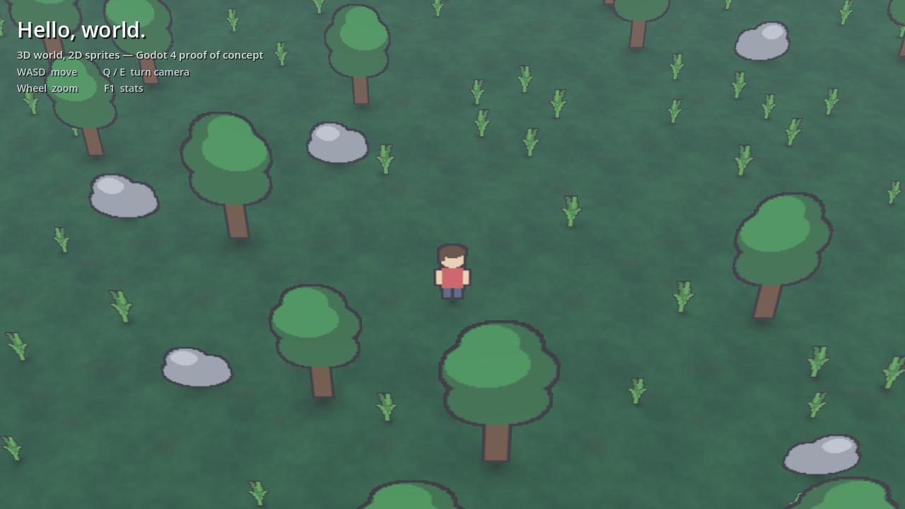
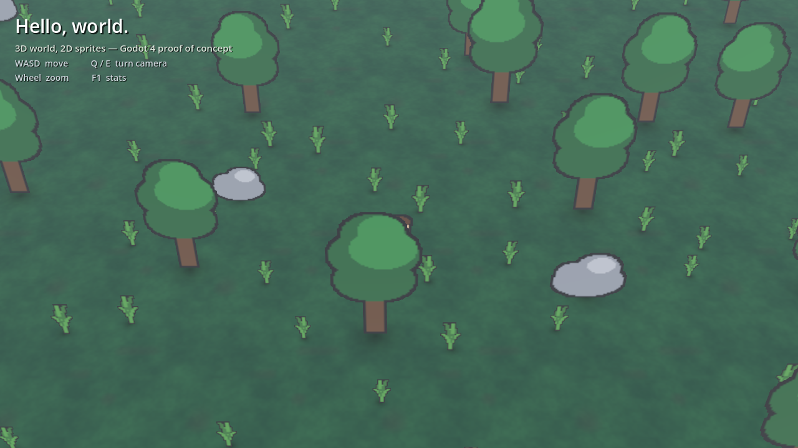
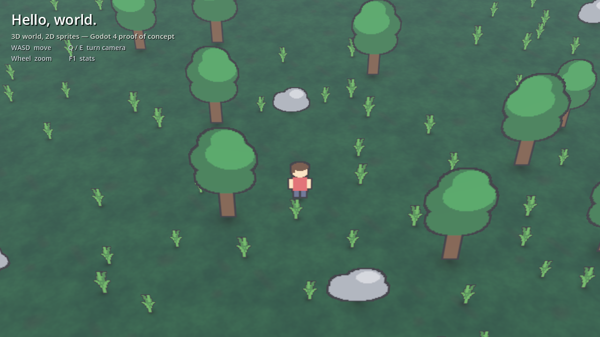

# 0003 — Godot Proof of Concept

**Status:** `[x]` complete — runs on the RTX 2080 Ti, all acceptance criteria met
**Branch:** `godot-poc`
**Depends on:** nothing. Deliberately parallel to `0002`, not downstream of it.
**Goal:** Find out what a Don't Starve-shaped game — a true 3D world drawn
entirely with 2D sprites — costs to build in Godot, by building the smallest
version of it that can be judged by looking at it.

**Scope:** the render pipeline and the camera. Not gameplay, not the survival
systems, not the world generator, not audio, not persistence.

---

## Why this exists

`0002` locked in *3D world, 2D assets* and started implementing it from scratch
in Rust and `wgpu` — chunked meshing, a value-noise heightmap, a terrain
renderer. That work is sound, but it is building an engine on the way to
building a game, and every one of those commits is a thing Godot already has.

This unit is the counterfactual: the same visual target, expressed in an engine
that already has a scene tree, a depth buffer, an asset importer, a physics
body and an editor. If the answer is "an afternoon", that is worth knowing
before another month goes into the renderer.

Nothing here is a commitment. Both branches now exist and can be compared.

## The decision that was handed to me: GDScript

The question was which language to write the proof of concept in. All three
options are live on this machine — Godot 4.6.1 **mono** is installed alongside
.NET SDK 8.0.403, so C# works out of the box, and `gdext` would let the
existing Rust experience carry over.

**GDScript**, for one reason that dominates: this is a proof of concept, and
its whole value is how fast a change becomes a picture on screen. GDScript
hot-reloads on save with no build step. C# puts a compile between every tweak
and every look; `gdext` puts a full recompile *and* an editor reload there.
Neither cost buys anything while the open question is still "does this look
right".

Secondary: every Godot tutorial, forum answer and doc example is GDScript, so
when something billboard-shaped goes wrong the search results are usable.

The cost is real but small at this scale — GDScript is slower than compiled
code, and its optional static typing (used throughout here: `var x: int`, typed
returns) is checked at parse time, not enforced the way Rust's is. A Don't
Starve-scale simulation does not come close to the point where that matters. If
it ever does, Godot runs C# and GDScript in the same project, so hot paths can
move without a rewrite.

## What it had to prove

- [x] **Sprites stand upright in a 3D world.** Y-axis billboarding — sprites
      yaw to face the camera but never pitch, so a tree stays a tree when the
      camera tilts down.
- [x] **Sprites sort correctly against each other and against the world, per
      pixel.** The failure this style dies from: a character walking behind a
      tree must be occluded by the *leaves*, not by the tree's bounding quad.
      See `shot-occlusion.png` — the player is behind a canopy and only their
      head shows through the gap.
- [x] **The camera can rotate freely** without any of that falling apart.
      `shot-rotated.png` is the same world position at 55°.
- [x] **Sprites are lit by the 3D scene**, so a day/night cycle later is a
      light rotation and not a re-authored asset set.
- [x] **Something moves through it under player control**, colliding with the
      world, with movement that stays screen-relative as the camera turns.
- [x] **It runs on the real GPU**, not a software fallback.
- [x] **It can be verified from a script**, not only by eye —
      `scripts/godot.sh shot` renders a PNG and exits.

## Evidence

The look: fixed-pitch camera, everything on screen a flat sprite standing on a
real ground plane, blob shadows sitting them on it.

The one that matters. The player is standing behind a tree and is occluded by
the canopy *per pixel* — only their head shows through. Whole-quad transparency
sorting cannot do this.

Same world position, camera turned 55°. Every sprite has yawed to face the new
camera direction and none of them has pitched.

## Tasks

- [x] Branch `godot-poc` off `main`.
- [x] `godot/` project skeleton — `project.godot`, input map, Forward+.
- [x] `tools/gen_placeholder_art.gd` — draw the placeholder PNGs procedurally
      so the repo has no binary art to maintain and the PoC runs from a clean
      checkout. Tileable value-noise ground, silhouette-outlined props.
- [x] `scripts/billboard_sprite_3d.gd` — the sprite rules, in one place.
- [x] `scenes/prop.tscn` + `scripts/prop.gd` — sprite, sized blob shadow,
      optional collider.
- [x] `scenes/player.tscn` + `scripts/player.gd` — `CharacterBody3D`,
      camera-relative movement, sprite facing, walk bob.
- [x] `scripts/camera_rig.gd` — yaw/pitch gimbal, framerate-independent follow,
      wheel zoom.
- [x] `scripts/world.gd` — seeded dart-throwing scatter, HUD, screenshot mode.
- [x] `scripts/godot.sh` — run/edit/import/art/shot/check, with the WSL→Windows
      path translation.
- [x] `tools/smoke_test.gd` — headless assertions for what a screenshot cannot
      show: that grass and trees really do have different collision, that the
      body settles with its origin on the ground, and that the four billboard
      settings are still what they are supposed to be.
- [x] Verify on the GPU and capture reference shots.

## What it deliberately does not do

Each of these is a real thing the game needs and a real thing this PoC is not
evidence about.

- **No animation.** The player has a cosmetic bob, not a walk cycle. Godot's
  `AnimatedSprite3D` covers frame animation and inherits everything in
  `billboard_sprite_3d.gd`, but nothing here proves the authoring pipeline for
  it.
- **No terrain height.** The ground is one flat plane. `0002` was building a
  heightmap; this PoC has no opinion on how that maps onto Godot, and the
  billboard-on-a-slope case is untested.
- **No chunking or streaming.** 340 props in one scene, all resident. Fine at
  this size, says nothing about an island.
- **No foliage fade.** `shot-occlusion.png` shows the correct behaviour and
  also the reason Don't Starve fades canopies out when the player walks under
  them — being fully hidden is accurate and unplayable.
- **No 8-direction facing.** The sprite mirrors horizontally; it does not turn.

## Findings worth carrying forward

1. **Four settings do all the work.** `BILLBOARD_FIXED_Y`,
   `ALPHA_CUT_DISCARD`, alpha-to-coverage, and a bottom-centre pivot. Every one
   of them has a plausible-looking wrong value, and three of the four are wrong
   by default. They are documented at the top of
   `scripts/billboard_sprite_3d.gd`.
2. **Alpha-cut, never alpha-blend.** Blended sprites sort whole-quad by origin
   and pop when they overlap. Discarding in the opaque pass gets per-pixel depth
   for free. This is the single decision the entire style rests on, and it is
   the same reason `0002/todo.md` argued for a 3D world in the first place —
   Godot just already has the depth attachment.
3. **Narrow the FOV.** Vertical billboards keystone toward the vanishing point,
   so at a wide FOV trees visibly lean outward at the screen edges. Dropping
   32° → 26° (and pushing the camera back to compensate) removes most of it.
   The limit of that trade is an orthographic camera, which kills the parallax
   that sells the depth; 26° is a middle.
4. **Blob shadows, not cast shadows.** A billboard's real shadow rotates as the
   camera turns, because the caster is turning. Every sprite here has
   `cast_shadow = 0` and a painted blob quad instead. This is why Don't Starve
   does it too.
5. **Mipmaps are off by default and it shows.** See `issues.md` §1.
6. **Scope, honestly measured:** 411 lines of GDScript across five game
   scripts (91 of them comment), three scene files, and a 221-line
   throwaway art generator — empty directory to the screenshots in this folder.
